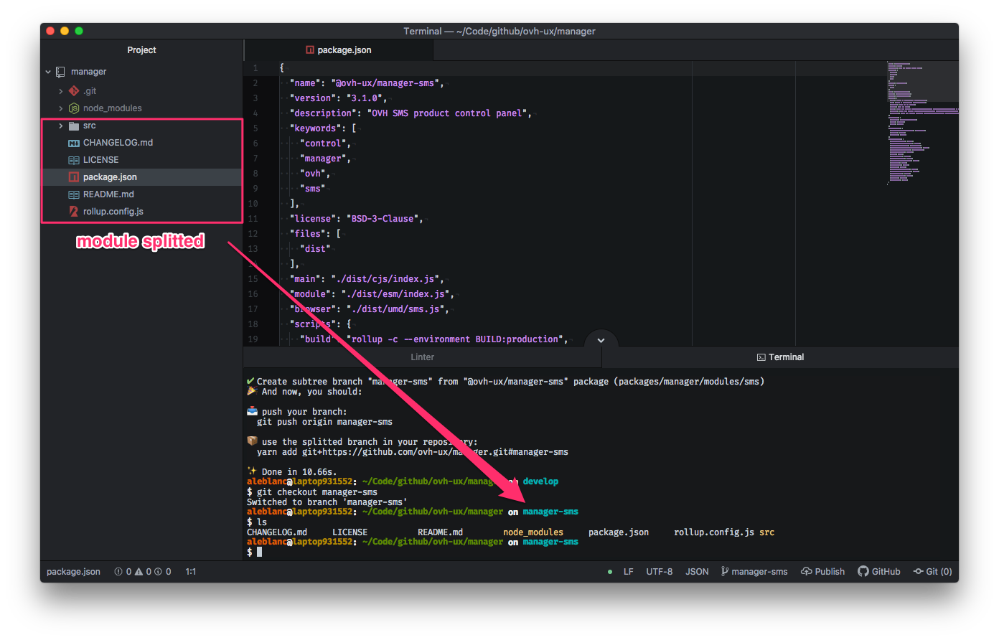

# OVH Manager Development

If you've made it this far, **thank you**! We appreciate your contribution, and hope that this document helps you along the way. If you have any questions or problems, don't hesitate to [file an issue](https://github.com/ovh-ux/manager/issues/new).

* [Install](#install)
* [Scripts](#scripts)
  * [Update README.md](#update-readmemd)
  * [Split a module](#split-a-module)
* [Import branch from legacy repository](#import-branch-from-legacy-repository)

## Install

If you have [`nvm`](https://github.com/nvm-sh/nvm) installed you can run `nvm use` at the root of the project to get the Node.js LTS version.

Run `yarn install` to install the npm dependencies.

## Scripts

Our [`package.json`](package.json) houses a collection of [run-scripts](https://docs.npmjs.com/cli/run-script) that we use to maintain, test, build, and publish the OVH Manager, notably:

* `docs:update-readme` runs `scripts/update-readme`, which update the list of all applications, modules and components available into this monorepo.
* `split` runs `scripts/split.js`, which generate a subtree branch (from the current one) for the specified package.

### Update README.md

```sh
$ yarn run docs:update-readme
```

### Split a module

```sh
$ yarn run split --help
```




## Import branch from legacy repository

### Checkout & pull develop

```sh
git checkout develop
git pull
```

### Create a branch from develop

```sh
git checkout -b feat/my-awesome-telecom-feature
```

### Import specific branch from legacy repository

See [List of git subtree prefixes by repository](#list-of-git-subtree-prefixes-by-repository) for more details.

```sh
git subtree pull --prefix=packages/manager/apps/telecom git@github.com:ovh-ux/ovh-manager-telecom.git feat/my-awesome-feature --squash
```

### Resolve conflicts if present

> Packages are renamed to `@ovh-ux/**` and are `private` now.
>
> Some dependencies have been updated (`ovh-angular-**` replaced by `@ovh-ux/ng-ovh-**`, `lodash` bumped to version 4), and all ESLint errors & warnings are fixed.

```sh
git merge --continue
```

It's done ! :)

### List of git subtree prefixes by repository

Use `PREFIX` and `REPOSITORY_URL` according the following table. `BRANCH_NAME` is the name of the legacy repository branch you want to import.

Add `--squash` option if you want to squash commits.

```sh
git subtree pull --prefix=[PREFIX] [REPOSITORY_URL] [BRANCH_NAME] --squash
```

| Repository  | PREFIX  | REPOSITORY_URL |
| ------------- | ------------- | ------------- |
| Manager Web  | `packages/manager/apps/web` | `git@github.com:ovh-ux/ovh-manager-web.git` |
| Manager Dedicated  | `packages/manager/apps/dedicated` | `git@github.com:ovh-ux/ovh-manager-dedicated.git` |
| Manager Cloud  | `packages/manager/apps/cloud` | `git@github.com:ovh-ux/ovh-manager-cloud.git` |
| Manager Telecom  | `packages/manager/apps/telecom` | `git@github.com:ovh-ux/ovh-manager-telecom.git` |
| Module Exchange  | `packages/manager/modules/exchange` | `git@github.com:ovh-ux/ovh-module-exchange.git` |
| Module SharePoint  | `packages/manager/modules/sharepoint` | `git@github.com:ovh-ux/ovh-module-sharepoint.git` |
| Module Office  | `packages/manager/modules/office` | `git@github.com:ovh-ux/ovh-module-office.git` |
| Module EmailPro  | `packages/manager/modules/emailpro` | `git@github.com:ovh-ux/ovh-module-emailpro.git` |
